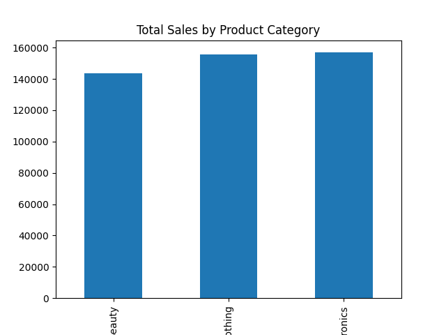
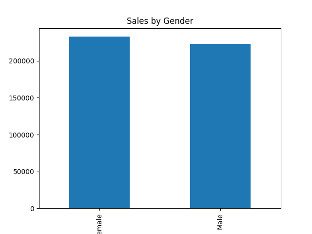
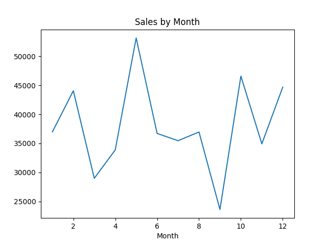
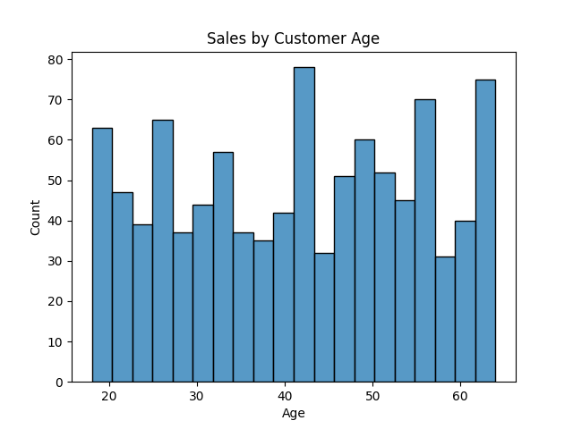

Retail Sales Data Analysis 🛒

Objective 🎯:
To analyze the sales performance of a retail store

Dataset 🛢️:
Retail sales dataset (1000 transactions)

Tools 🔨:
- Python
- Pandas
- Matplotlib
- Seaborn

Analysis performed 🔎:
- Sales by product category
- Sales by gender
- Sales by month
- Sales by Age distribution
- Top customers

Conclusions 📌: 

## Sales by Product category

- The analysis of sales by product category shows that Electronics generated the highest total revenue, accounting for 34.4%.% of total sales. In contrast, Beauty contributed the least with approximately 31.5% of total sales. This indicates that Electronics is the most demanded category contributing 0.85% more than the lowest category.

## Sales by gender

- When analyzing sales by gender, Female customers generated the highest total sales with $232,840 / 51.06% of total sales, while Male accounted for $223,160 / 49.4% of total sales. The difference between both groups is $9,680, which represents a 4.34% higher spending level for Female customers.

## Sales by Month

- The highest sales ocurred in May with approximately $53,150, while September had the lowest sales at around $23,620. This represents a difference of $29,530 between the peak and lowest month.

## Sales by Age distribution

- Customers aged 46-55 generated the highest revenue with $100,690, representing 22.08% of total sales. In contrast, the 18-25 group contributed $73,335, the lowest among all age segments.